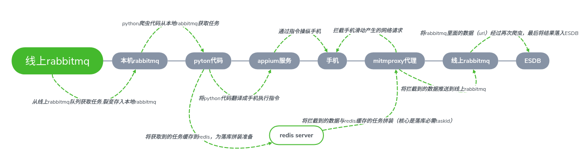

# spider_man_app 说明文档 #

责任人：石小龙

***项目设计思路***
--
>后面补充...

***项目运行的核心组件***
--

|核心组件  |作用                                                                                                                                     |备注|
|---------|----------------------------------------------------------------------------------------------------------------------------------------|----|
|redis    |缓存线上队列过来的task消息体，该消息体需要组合爬到的数据传递到数据库，但是采集的数据是通过Mitmproxy拦截的，无法直接传递数据流，故缓存到redis以便于后面就拼装|docker启动，端口6370|
|rabbitmq |线上队列一个消息体在接收后根据app数量裂变成多个消息体，未解决消息体持久化问题（断点续爬），故建立本地rabbitmq队列                                      |docker启动，端口默认|
|appium   |作为python代码和手机app指令之间的翻译器，操纵手机的中介                                                                                        |sh 脚本启动|
|mitmproxy|所有需要采集的数据并不直接通过appium服务来获取（获取难度大），而是间接通过代理服务拦截列表页的详情url，将详情UＲＬ落入数据库，故该组件的核心作用是拦截数据　　|ssh 脚本启动|
|手机硬件  |接受代码指令，操作app，完成自动化，拿到目标数据　　　　　　　　　　　　　　　　　　　　　　　　　　　　　　　　　　　　　　　　　　　　　　　　　　　　　　　　|数量：５台，系统：小米，品牌型号：乐视|

***环境配置***
--
   - appium:v1.12.1
       + nvm:latest 
       + node:8.9.4
       + npm install -g appium@1.12.1
   - adb:latest
       + sudo apt-get install adb
   - docker(redis:latest,rabbitmq:3.7-management)
       + redis映射本地 127.0.0.1:6370
       + rabbitmq映射本地 127.0.0.1:5672,127.0.0.1:15672
   - minicoda(python:3.6)
       + 默认base环境为运行环境

***appium 启动***
--
   - src文件下启动appium_start.py
   

***mitmproxy以及中间队列启动***
--
  - beta测试环境
    + 启动 ./beta_start.sh
    + mitmproxy 监听端口8888
  - prod生产环境
    + 启动 ./pro_start.sh
    + mitmproxy 监听端口8888

***app自动化执行***
--
  - sudo python3 start_app.py

***项目优化历程***
--
   - mitm 拦截的接口更新调整
   - 元素无法定位的报错bug未解决，具体是哪个app无法定位元素目前尚未确定
   - 天天快报mitm拦截，json解析优化
   - 已经采集数据推送时消息体log优化
   - 爬虫故障具体app信息的打印
   - 解决redis key 存储关键词时 空格下划线英文逗号之间转换不一致，
   导致无法获取redis 数据的问题
   - 手机真机复苏，与前任对接时交代的存在问题的手机，部分可用
   - 手机 app 手动更新，手机缓存清理（app更新，与缓存清理，后面考虑自动化）
   - redis在存储task时bug，导致非过期任务被误杀，问题解决
   - sohu 搜索功能所有手机全部被封锁，设备伪造需要时间，
   目前市场上有三方服务对伪造的设备号也可以识别（算法破解难度50万），故目前只能先暂停sohu
   - 一点资讯出现了设备被锁问题，真机如果要改机，需要解决root 和 xpos问题，目前状态解决也相对耗时（不建议用真机采集）
   - 目前仅剩‘天天快报’和‘zaker’没毛病
   - adb offline 问题重启手机可以解决，可能是同时安装了uiautomator2 和 appium 服务app导致adb端口占用
   - 在手机有调整后，如果不重启appium服务，可能会导致connectionpool的报错
   - 启动解决爬虫启动时wedriver无法json序列化的BUG
   - 虽然手机自动化可以绕过请求参数加密，但是响应体加密依旧是无法绕过，如果采用mitmproxy拦截响应体的方式获取数据，未来将越来越难
   - js逆向，网站漏洞探索，反编译，爬虫渐渐干成了黑客；
   
   
   
   
   
   
   
   
   
***appium存在的一些问题***
--
   - 手机键盘切换繁琐
   - 服务占用资源较多
   - 接口调用繁琐，链路长，存在的问题就会多，bug可能性大
   - appium-desktop 链接手机繁琐，开发调试不方便
   - 一个appium服务，在目前的认知范围内只能服务一台手机,
   - appium操作手机的运行速度要慢很多
   - appium 程序调用键盘较为繁琐，并且在手机调试过程中切换也较为繁琐
   - 
   
   